### 概况
    一个方法体系
    需求 -> Pre-architecture -> Conceptual Architecture -> Refined Architecture -> 架构
    PA: 全面理解需求，把握需求特点、确定架构设计驱动力
   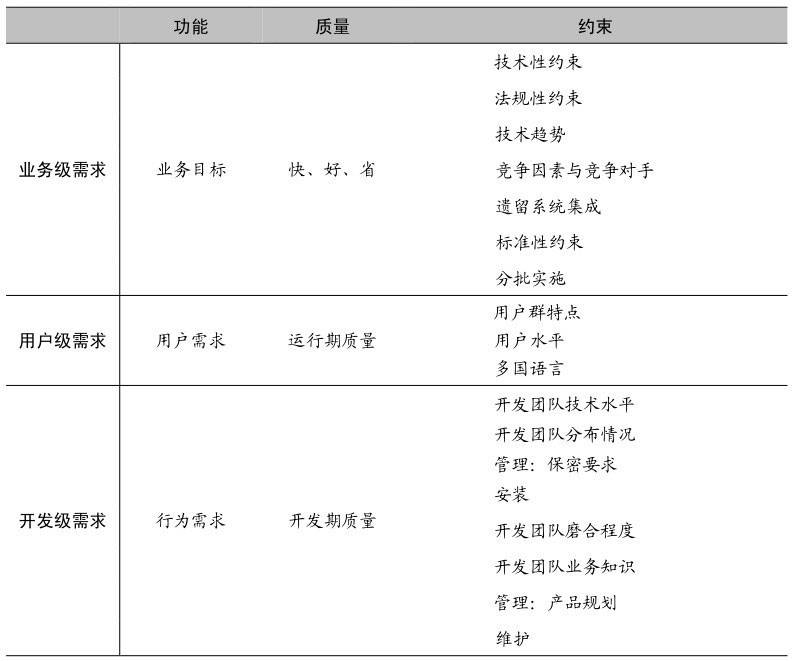

    CA: 重大需求塑造概念架构
        概念架构 ≠ 理想架构
   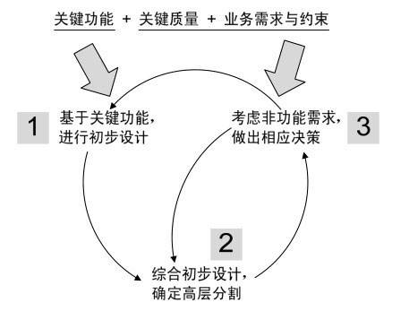

    RA: 落地的5视图法
        细化架构是针对概念架构的
        参考下面的5视图
   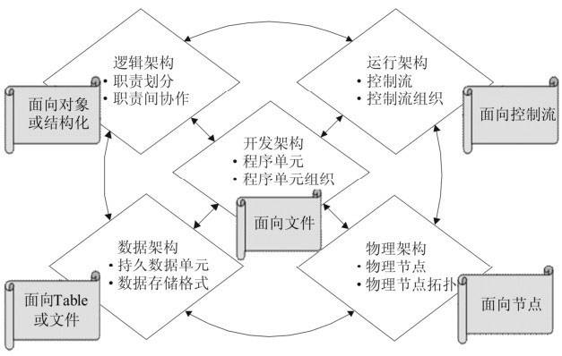

    持续关注非功能需求： 目标-场景-决策
   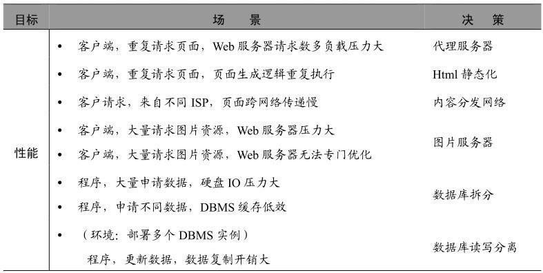

    6大困惑

   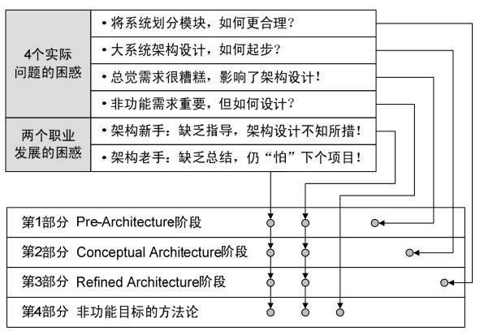

### PA 功能+质量+约束

    方案的制定需要 项目负责人+需求人员+架构师等角色的共同参与
    方案 = 项目+需求+架构
    方案 != 架构的全部内容

### CA 概念架构

    接口：不关心
    子系统：只有抽象的组件，没有接口，只有职责；一般是 处理组件、数据组件、连接组件的一种；大组件分解成小组件
    交互机制：概念化的，如A组件使用B组件的服务

### RA 细化架构

    接口：非核心地位；
    子系统：重视通过子系统和模块来分割整个系统，并且子系统有明确的接口；
    交互机制：实实在在的，如基于接口编程、消息机制或远程方法调用等；

   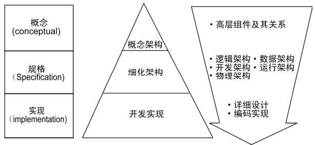

#### 贴近实践的多视图方法，应将一线架构师的各项工作涵盖其中

    兼顾多个视图之间的一致性

   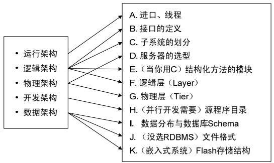
#### RUP 4+1
   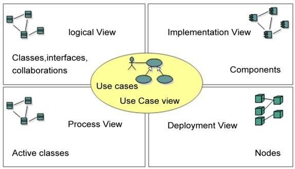

   [RUP 4+1](https://www.ibm.com/developerworks/cn/rational/06/r-wenyu/index.html)

    4：架构设计
    +1：驱动因素

    特点
    1、重视OO方法
    2、use case驱动
    3、强调模型的重要性

    OO可以指导逻辑视图的设计，对物理视图影响较弱
    用例不是架构设计本身的工作
    建模切记穷兵黩武

#### SEI 3视图

   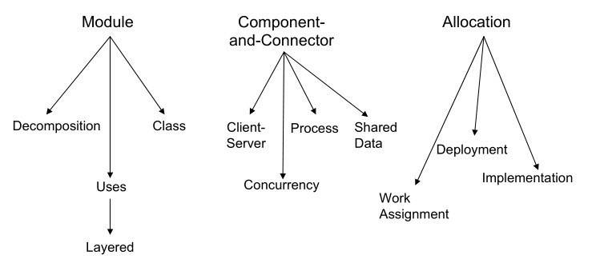

    模块视图
    组件-连接器视图
    分配视图
#### 西门子4视图法

    概念视图
    模块视图
    代码视图
    执行视图

#### 联邦企业架构框架

    技术架构视图
    信息架构视图
    应用机构视图
    业务架构视图

#### 5视图方法

    有角度就有空间
   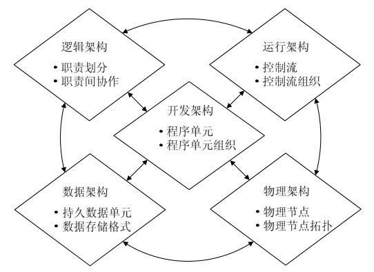

    详情

   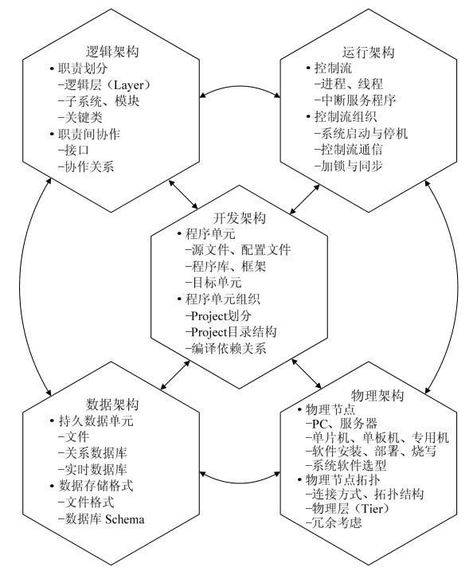

    协作决定接口

##### 划分子系统的3种必要策略

    分层的细化

        初始先分层

    分区的引入

        只有分层如何迭代开发呢
        分区是一个单元；
        深度优先 式的迭代开发

    机制的提取

        机制才是设计的灵魂所在
        软件系统中的机制：预先定义好的、能够完成预期目标的、基于角色抽象的协作方式；
        机制 = 协作关系 + 协作流程
        基于接口（抽象类）的协作是机制；
        机制是一种特殊的子系统--不要遗忘

    如何通过关注点的分离达到“系统中的一部分发生了改变，不会影响其他部分”的目标？
    1、职责划分来分离关注点
    2、通用性不同进行关注点分离
##### 划分子系统的4个重要原则

    职责不同的单元划归不同的子系统
    通用性不同的单元划归不同的子系统
    需要不同开发技能的单元划归不同子系统
    兼顾工作量的相对均衡，进一步切分太大的子系统

    接口设计的事实与谬误
        ”分“是手段，”合“是目的
        协作决定接口
        “我的接口我做主”的错误认知

##### 逻辑架构设计
    质疑驱动
    结构设计和行为设计相分离

    不断设计中间成果 -> 不断的质疑中间成果 -> 不断完善细化中间成果 的过程

##### 物理架构
    增加硬件 = 增加运算能力 ≠ 软件的实际服务能力
    关注点：计算机、网络、硬件设施、部署、运行时配置，相互影响；
    可靠性、可伸缩性、持续可用性、性能、安全性等

   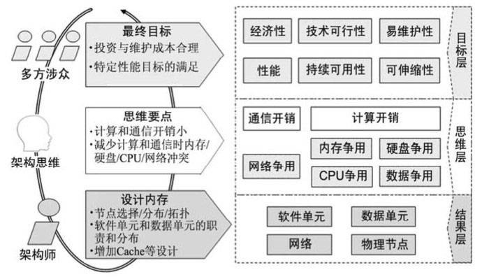

##### 运行架构

    需求：并行或并发处理；基于SDK、API等基层软件进行定制开发；
    控制流：一个处理机上顺序执行的动作序列
    节点间通信：引入一条控制流来专门处理
    控制流的3种手段
        进程
        线程
        中断服务程序

##### 开发架构

    必要的

    开发架构视图

    程序单元
    源码目录

    目标：能支持并行的详细设计

    开发人员参与，避免碰头儿临时决定，造成软件质量下降或者项目失败

    逻辑职责 映射 到 程序单元
    1、要自主编写的源程序
    2、可重用的库和框架
    3、其他方式（shell脚本、平台支持下的配置文件）

    开发技术选型
    1、开发语言
    2、开发工具

    程序单元 间的关系
    1、Project划分
    2、Project目录结构
    3、编译依赖关系

    重用性的思考
    重交付、轻维护
    重小粒度重用、轻大粒度重用
    重用价值 = 重用次数 * 单次价值
    重用测试是关键

    设计模式在重用技术中占据什么位置？
##### 数据架构

    难点：数据分布
    数据库设计错误和架构错误无法挽回

    数据分布6种策略
    1、独立Schema（Separate-schema）
        大系统下的小系统独有不同的数据库schema

    2、集中
        统一存储数据
        集中存储，分布访问
    3、分区
        水平分区

        垂直分区
    4、复制
    5、子集
    6、重组

### 贯穿案例

    持续不断的考虑非功能性需求

    架构设计应该进行到什么程度
        1、为开发人员提供足够的指导和限制
            可支持并行的详细设计
        2、因项目、开发团队的情况的不同而变化
            考虑项目熟悉程度、风险高低、团队技术水平等
        3、业务层、通信机制应更深入的设计
            核心模型应更深入的设计、应当更深入的设计；
            通用机制影响易理解性和Bug率，应更深入的设计

    非功能需求

    架构师必须懂需求吗？
    功能需求，非功能需求都要懂吗？
    生搬硬套需求标准是“懂需求”的表现吗？
    应当如何有效传达非功能目标的具体需求？

    架构师必须懂需求
        与 需求分析师所掌握的需求 不太一样 有一定的交叉
        如需：需求类型、需求影响架构的原理、质量属性间的互相影响关系等
    敢说ISO 9126不对，真牛

    交流质量要求，如何做到“说得清、听得明白”
        场景化
        目标-场景-决策

    如何明确定义非功能需求
        设计贵在务实、贵在有针对性

    场景5要素
        1、影响来源（系统内部或者外部）
        2、如何有效
        3、受有效对象
        4、问题或价值
        5、所处环境

        评估要素
        价值大小
        代价大小
        开发难度高低
        技术趋势
        出现几率

        不支持某场景-重要决策，懂得取舍

