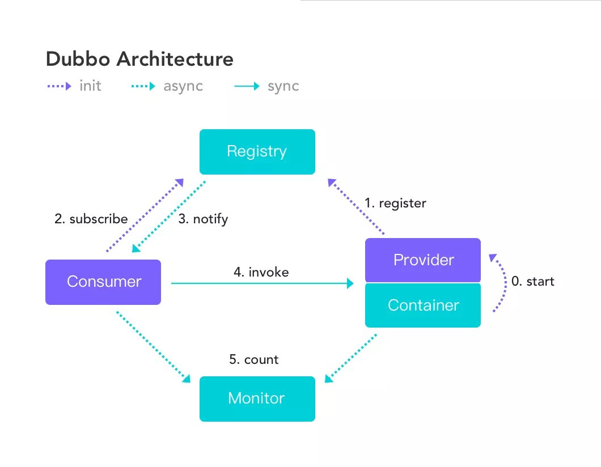
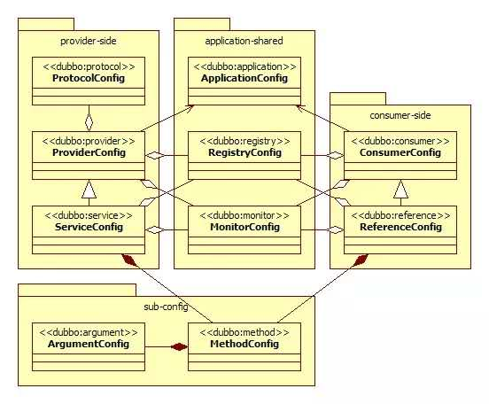
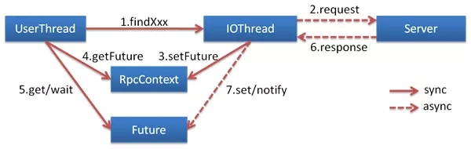
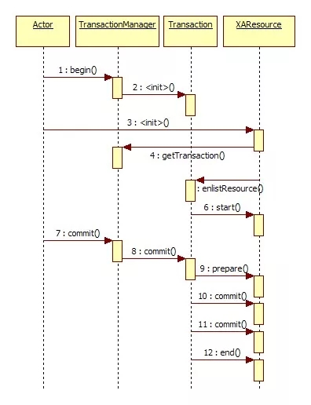

#### 1、Dubbo是什么？
    基于 Java 的高性能 RPC 分布式服务框架
    最大的特点是按照分层的方式来架构，使用这种方式可以使各个层之间解耦合（或者最大限度地松耦合）

#### 2、为什么要用dubbo
    成功案例较多，避免踩坑，社区活跃
    netty、zk保证了高可用高性能
    分离业务核心，提高业务复用性、灵活性
    完善的服务治理

#### 3、dubbo vs spring cloud
    a、通信方式 rpc vs http restful
    b、组成部分
        组件          Dubbo               Spring Cloud
        服务注册中心    Zookeeper           Spring Cloud Netflix Eureka/consul
        服务监控       Dubbo-monitor       Spring Boot Admin
        断路器        不完善                Spring Cloud Netflix Hystrix
        服务网关       无                   Spring Cloud Netflix Gateway/zuul
        分布式配置     无                   Spring Cloud Config
        服务跟踪       无                   Spring Cloud Sleuth
        消息总线       无                   Spring Cloud Bus
        数据流        无                   Spring Cloud Stream
        批量任务       无                   Spring Cloud Task
#### 4、支持的协议
    dubbo
    rmi
    hessian
    http
    webservice
    thrift
    memcached
    redis
    rest

    dubbo：          单一长连接和NIO异步通讯，适合大并发小数据量的服务调用，以及消费者远大于提供者。传输协议TCP，异步，Hessian序列化；
    rmi：            采用JDK标准的rmi协议实现，传输参数和返回参数对象需要实现Serializable接口，使用java标准序列化机制，使用阻塞式短连接，传输数据包大小混合，
                        消费者和提供者个数差不多，可传文件，传输协议TCP。 多个短连接，TCP协议传输，同步传输，适用常规的远程服务调用和rmi互操作。
                        在依赖低版本的Common-Collections包，java序列化存在安全漏洞；
    webservice：     基于WebService的远程调用协议，集成CXF实现，提供和原生WebService的互操作。多个短连接，基于HTTP传输，同步传输，适用系统集成和跨语言调用；
                        http： 基于Http表单提交的远程调用协议，使用Spring的HttpInvoke实现。多个短连接，传输协议HTTP，传入参数大小混合，提供者个数多于消费者，
                        需要给应用程序和浏览器JS调用；
    hessian：        集成Hessian服务，基于HTTP通讯，采用Servlet暴露服务，Dubbo内嵌Jetty作为服务器时默认实现，提供与Hession服务互操作。多个短连接，同步HTTP传输，
                        Hessian序列化，传入参数较大，提供者大于消费者，提供者压力较大，可传文件；
    memcache：       基于memcached实现的RPC协议
    redis：          基于redis实现的RPC协议

#### dubbo通信协议dubbo协议为什么要消费者比提供者个数多
    因dubbo协议采用单一长连接，假设网络为千兆网卡(1024Mbit=128MByte)，
    根据测试经验数据每条连接最多只能压满7MByte(不同的环境可能不一样，供参考)，理论上1个服务提供者需要20个服务消费者才能压满网卡。

#### dubbo通信协议dubbo协议为什么不能传大包：
    因dubbo协议采用单一长连接，
    如果每次请求的数据包大小为500KByte，假设网络为千兆网卡(1024Mbit=128MByte)，每条连接最大7MByte(不同的环境可能不一样，供参考)，
    单个服务提供者的TPS(每秒处理事务数)最大为：128MByte / 500KByte = 262。
    单个消费者调用单个服务提供者的TPS(每秒处理事务数)最大为：7MByte / 500KByte = 14。
    如果能接受，可以考虑使用，否则网络将成为瓶颈。
#### dubbo通信协议dubbo协议为什么采用异步单一长连接：
    因为服务的现状大都是服务提供者少，通常只有几台机器， 而服务的消费者多，可能整个网站都在访问该服务，
    比如Morgan的提供者只有6台提供者，却有上百台消费者，每天有1.5亿次调用， 如果采用常规的hessian服务，服务提供者很容易就被压跨，
    通过单一连接，保证单一消费者不会压死提供者， 长连接，减少连接握手验证等， 并使用异步IO，复用线程池，防止C10K问题。
#### 5、dubbo需要web容器吗
    不需要
    如果硬要，增加复杂性、浪费资源
#### 6、dubbo内置的服务容器
    spring container
    jetty container
    Log4j container
    Dubbo 的服务容器只是一个简单的 Main 方法，并加载一个简单的 Spring 容器，用于暴露服务。

#### 7、dubbo的节点角色
    节点         角色说明
    Provider    暴露服务的服务提供方
    Consumer    调用远程服务的服务消费方
    Registry    服务注册与发现的注册中心
    Monitor     统计服务的调用次数和调用时间的监控中心
    Container   服务运行容器

#### 8、服务注册和发现的流程图

   

#### 9、默认注册中心，还有别的选择吗
    dubbo-registry
    zookeeper
    其他：
    redis
    multicast
    simple
    不推荐

####  Dubbo中zookeeper做注册中心，如果注册中心集群都挂掉，发布者和订阅者之间还能通信么？
    可以通信的，启动dubbo时，消费者会从zk拉取注册的生产者的地址接口等数据，缓存在本地。每次调用时，按照本地存储的地址进行调用；
    注册中心对等集群，任意一台宕机后，将会切换到另一台；注册中心全部宕机后，服务的提供者和消费者仍能通过本地缓存通讯。服务提供者无状态，任一台 宕机后，不影响使用；
    服务提供者全部宕机，服务消费者会无法使用，并无限次重连等待服务者恢复；
    挂掉是不要紧的，但前提是你没有增加新的服务，如果你要调用新的服务，则是不能办到的。

#### 10、配置方式
    spring（xml，springboot的注解）
    java api

#### 核心配置
    dubbo:service
    dubbo:reference
    dubbo:protocol
    dubbo:application
    dubbo:module 模块配置
    dubbo:registry
    dubbo:monitor
    dubbo:provider
    dubbo:consumer
    dubbo:method
    dubbo:argument

   

#### 在 Provider 上可以配置的 Consumer 端的属性有哪些？

     1）timeout：方法调用超时
     2）retries：失败重试次数，默认重试 2 次
     3）loadbalance：负载均衡算法，默认随机
     4）actives 消费者端，最大并发调用限制

#### Dubbo启动时如果依赖的服务不可用会怎样？

     Dubbo 缺省会在启动时检查依赖的服务是否可用，不可用时会抛出异常，阻止 Spring 初始化完成，默认 check=“true”，可以通过 check=“false” 关闭检查。

#### Dubbo推荐使用什么序列化框架，你知道的还有哪些？
     dubbo-serialization
     推荐使用Hessian序列化，还有Duddo、FastJson、Java自带序列化、kryo、protobuff、fst。
     FST是Java快速序列化的简易替代者。

#### Dubbo默认使用的是什么通信框架，还有别的选择吗？
     dubbo-remoting
     Dubbo 默认使用 Netty 框架，也是推荐的选择，另外内容还集成有Mina、Grizzly、http、netty4、p2p、zookeeper。

#### Dubbo有哪几种集群容错方案，默认是哪种？

     集群容错方案	        说明
     Failover Cluster	失败自动切换，自动重试其它服务器（默认）
     Failfast Cluster	快速失败，立即报错，只发起一次调用
     Failsafe Cluster	失败安全，出现异常时，直接忽略
     Failback Cluster	失败自动恢复，记录失败请求，定时重发
     Forking Cluster	并行调用多个服务器，只要一个成功即返回
     Broadcast Cluster	广播逐个调用所有提供者，任意一个报错则报错

#### Dubbo有哪几种负载均衡策略，默认是哪种？

     负载均衡策略	                    说明
     Random LoadBalance	            随机，按权重设置随机概率（默认）在一个截面上碰撞的概率高，但调用量越大分布越均匀，而且按概率使用权重后也比较均匀，有利于动态调整提供者权重。

     RoundRobin LoadBalance	        轮询，按公约后的权重设置轮询比率，存在慢的提供者累积请求问题，比如：第二台机器很慢，但没挂，当请求调到第二台时就卡在那，久而久之，所有请求都卡在调到第二台上。
     LeastActive LoadBalance	    最少活跃调用数，相同活跃数的随机；使慢的提供者收到更少请求，因为越慢的提供者的调用前后计数差会越大。
     ConsistentHash LoadBalance	    一致性 Hash，相同参数的请求总是发到同一提供者；当某一台提供者挂时，原本发往该提供者的请求，基于虚拟节点，平摊到其它提供者，不会引起剧烈变动。缺省只对第一个参数Hash，如果要修改，请配置
        <dubbo:parameter key="hash.arguments" value="0,1" />
        缺省用160份虚拟节点，如果要修改，请配置
        <dubbo:parameter key="hash.nodes" value="320" />
#### 注册了多个同一样的服务，如果测试指定的某一个服务呢？

     可以配置环境点对点直连，绕过注册中心，将以服务接口为单位，忽略注册中心的提供者列表。

#### Dubbo支持服务多协议吗？

     Dubbo 允许配置多协议，在不同服务上支持不同协议或者同一服务上同时支持多种协议。

#### 当一个服务接口有多种实现时怎么做？

     当一个接口有多种实现时，可以用 group 属性来分组，服务提供方和消费方都指定同一个 group 即可。
#### 服务上线怎么兼容旧版本？

     可以用版本号（version）过渡，多个不同版本的服务注册到注册中心，版本号不同的服务相互间不引用。这个和服务分组的概念有一点类似。
#### Dubbo可以对结果进行缓存吗？

     可以，Dubbo 提供了声明式缓存，用于加速热门数据的访问速度，以减少用户加缓存的工作量。
#### Dubbo服务之间的调用是阻塞的吗？

     默认是同步等待结果阻塞的，支持异步调用。
     Dubbo 是基于 NIO 的非阻塞实现并行调用，客户端不需要启动多线程即可完成并行调用多个远程服务，相对多线程开销较小，异步调用会返回一个 Future 对象。

   

#### Dubbo支持分布式事务吗？

     目前暂时不支持，后续可能采用基于 JTA/XA 规范实现，如以图所示。

   

#### Dubbo telnet 命令能做什么？

     dubbo 通过 telnet 命令来进行服务治理

   [参考](https://mp.weixin.qq.com/s/0OSXVundismrRSR4mG-kEQ)

#### dubbo支持服务降级吗？
    Dubbo 2.2.0 以上版本支持
    降级策略：
        页面拒绝服务：页面提示由于服务繁忙此服务暂停。跳转到varnish或nginx的一个静态页面。
        服务接口拒绝服务：无用户特定信息的页面能访问，提示服务器繁忙。页面内容也可在缓存（Varnish）或CDN内获取。
        延迟持久化：页面访问照常，但是涉及记录变更，会提示稍晚能看到结果，将数据记录到异步队列或log，服务恢复后执行。
        随机拒绝服务：服务接口随机拒绝服务，让用户重试，目前较少采用。因为用户体验不佳。
    服务降级埋点：
        消息中间件
            所有API调用请求可以使用消息中间件进行控制，这可以有效地处理请求流量的增长，避免服务压力过大，导致服务雪崩效应。缺点是，增加了服务处理和业务处理的复杂性。
        前端页面
            指定网址不可访问（NGINX等load balance来处理），处理简单。缺点是用户体验非常不好。
        底层数据层
            拒绝所有增删改动作，只允许查询。此时用户可以查看所有的查询处理页面和业务，但无法进行有更新修改的操作。

    dubbo降级实现
        <dubbo:reference id="iUser" interface="com.dubbosample.iface.IUser"  timeout="10000" check="false" mock="return null" />
        通过mock的配置，可以很好的实现dubbo服务降级
        （1）将接口进行归类，分成查询操作类、变更操作类：对于查询的操作分为一个接口类，变更的归类为其他的接口类，这样对于查询的可以使用mock=”return null”进行降级操作；对于变更类的操作接口，可以仍旧使用try……catch进行异常捕获处理；
        （2）配置mock=”true”，同时mock实现接口，接口名要注意命名规范：接口名+Mock后缀。此时如果调用失败会调用Mock实现。mock实现需要保证有无参的构造方法。

    dubbo.reference.default.break.limit：该参数是配置一个方法在指定时间内出现多少个异常则判断为服务提供方宕机
    dubbo.reference.default.retry.frequency：该参数配置重试频率，比如配置100，则表示没出现一百次异常则尝试一下远程服务是否可用
    dubbo.reference.circuit.break:服务降级功能开关，默认是false，表示关闭状态，可以配置为true

#### Dubbo如何优雅停机？

     Dubbo 是通过 JDK 的 ShutdownHook 来完成优雅停机的，所以如果使用 kill -9 PID 等强制关闭指令，
     是不会执行优雅停机的，只有通过 kill PID 时，才会执行。

#### 服务提供者能实现失效踢出是什么原理？

     服务失效踢出基于 Zookeeper 的临时节点原理。

#### 如何解决服务调用链过长的问题？

     Dubbo 可以使用 Pinpoint 和 Apache Skywalking(Incubator) 实现分布式服务追踪，当然还有其他很多方案。
     可以结合zipkin实现分布式服务追踪。
     点评cat？

#### 服务读写推荐的容错策略是怎样的？集群容错怎么做？

     读操作建议使用 Failover 失败自动切换，默认重试两次其他服务器。

     写操作建议使用 Failfast 快速失败，发一次调用失败就立即报错。
#### Dubbo必须依赖的包有哪些？

     Dubbo 必须依赖 JDK，其他为可选。
#### Dubbo的管理控制台能做什么？

     管理控制台主要包含：路由规则，动态配置，服务降级，访问控制，权重调整，负载均衡，等管理功能。

#### 说说 Dubbo 服务暴露的过程。
     dubbo-config ServiceConfig
     Dubbo 会在 Spring 实例化完 bean 之后，在刷新容器最后一步发布 ContextRefreshEvent 事件的时候，
     通知实现了 ApplicationListener 的 ServiceBean 类进行回调 onApplicationEvent 事件方法，
     Dubbo 会在这个方法中调用 ServiceBean 父类 ServiceConfig 的 export 方法，而该方法真正实现了服务的（异步或者非异步）发布。

#### Dubbo 停止维护了吗？

     2014 年开始停止维护过几年，17 年开始重新维护，并进入了 Apache 项目。
#### Dubbo 和 Dubbox 有什么区别？

     Dubbox 是继 Dubbo 停止维护后，当当网基于 Dubbo 做的一个扩展项目，如加了服务可 Restful 调用，更新了开源组件等。
#### 你还了解别的分布式框架吗？

     别的还有 Spring cloud、Facebook 的 Thrift、Twitter 的 Finagle 等。
#### Dubbo 能集成 Spring Boot 吗？

   [链接](https://github.com/apache/incubator-dubbo-spring-boot-project)

#### 在使用过程中都遇到了些什么问题？

     Dubbo 的设计目的是为了满足高并发小数据量的 rpc 调用，在大数据量下的性能表现并不好，建议使用 rmi 或 http 协议。

#### 你读过 Dubbo 的源码吗？

#### 你觉得用 Dubbo 好还是 Spring Cloud 好？

    没有好坏，只有适合不适合，不过我好像更倾向于使用 Dubbo,
    Spring Cloud 版本升级太快，组件更新替换太频繁，配置太繁琐

#### 配置中心
    zookeeper
    appollo

#### dubbo在安全机制方面如何解决的？

     dubbo通过token令牌防止用户绕过注册中心直连，然后在注册中心管理授权，dubbo提供了黑白名单，控制服务所允许的调用方。

#### 在使用过程中都遇到了些什么问题？ 如何解决的？
    1、同时配置了XML和properties文件，则properties中的配置无效
        只有XML没有配置时，properties才生效。
    3.为了方便开发测试，线下有一个所有服务可用的注册中心，这时，如果有一个正在开发中的服务提供者注册，可能会影响消费者不能正常运行。
        解决：让服务提供者开发方，只订阅服务，而不注册正在开发的服务，通过直连测试正在开发的服务。设置dubbo:registry标签的register属性为false
    4、spring 2.x初始化死锁问题。
        在spring解析到dubbo:service时，就已经向外暴露了服务，而spring还在接着初始化其他bean，如果这时有请求进来，并且服务的实现类里有调用applicationContext.getBean()的用法。getBean线程和spring初始化线程的锁的顺序不一样，导致了线程死锁，不能提供服务，启动不了。
        解决：不要在服务的实现类中使用applicationContext.getBean();如果不想依赖配置顺序，可以将dubbo:provider的deplay属性设置为-1，使dubbo在容器初始化完成后再暴露服务。
    5、服务注册不上
        检查dubbo的jar包有没有在classpath中，以及有没有重复的jar包
        检查暴露服务的spring配置有没有加载
        在服务提供者机器上测试与注册中心的网络是否通
    6.出现RpcException: No provider available for remote service异常
        表示没有可用的服务提供者，
        1). 检查连接的注册中心是否正确
        2). 到注册中心查看相应的服务提供者是否存在
        3). 检查服务提供者是否正常运行
    7.出现”消息发送失败”异常
        通常是接口方法的传入传出参数未实现Serializable接口。

#### 源码解析
