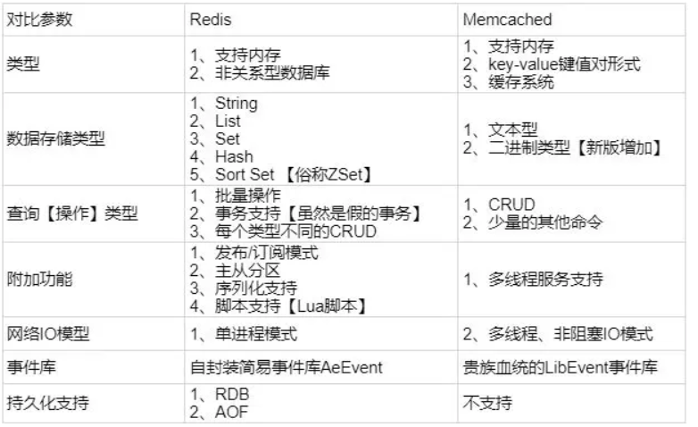

### 什么是Redis？

     C 语言写成的，开源的 key-value 数据库
     包括string(字符串)、list(链表)、set(集合)、zset(sorted set --有序集合)和hash（哈希类型）
     这些数据类型都支持push/pop、add/remove及取交集并集和差集及更丰富的操作，而且这些操作都是原子性的。

     与memcached一样，为了保证效率，数据都是缓存在内存中。
     redis会周期性的把更新的数据写入磁盘或者把修改操作写入追加的记录文件，并且在此基础上实现了master-slave(主从)同步

### Redis与Memcached的区别与比较
    Redis不仅仅支持简单的k/v类型的数据，同时还提供list，set，zset，hash等数据结构的存储。memcache支持简单的数据类型，String。
    Redis支持数据的备份，即master-slave模式的数据备份
    Redis支持数据的持久化，可以将内存中的数据保持在磁盘中，重启的时候可以再次加载进行使用,而Memecache把数据全部存在内存之中
    redis的速度比memcached快很多
    Memcached是多线程，非阻塞IO复用的网络模型；Redis使用单线程的IO复用模型。

   

### Redis与Memcached的选择
    使用Redis的String类型做的事，都可以用Memcached替换，以此换取更好的性能提升； 除此以外，优先考虑Redis；

### redis有哪些好处？
    速度快
    支持丰富数据类型
    支持事务：redis对事务是部分支持的，如果是在入队时报错，那么都不会执行；在非入队时报错，那么成功的就会成功执行
    redis监控：锁
    丰富的特性：缓存、消息、按key设置过期时间

### 常见数据结构使用场景
    string
        常规计数：微博数、粉丝数等
    hash
        Hash是一个string类型的field和value的映射表，hash特别适合用于存储对象。

