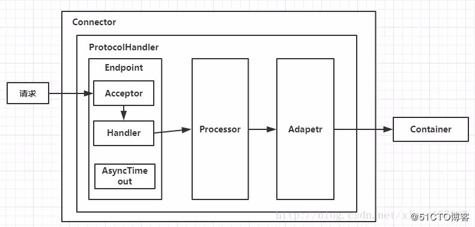
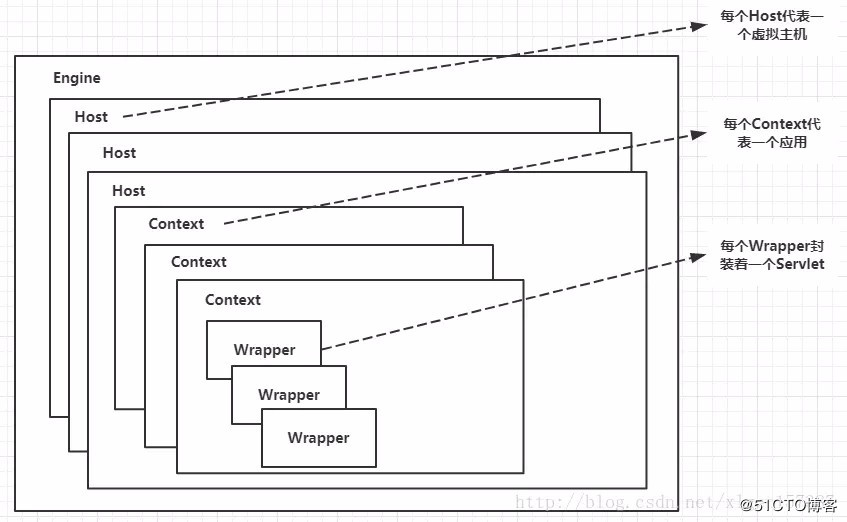
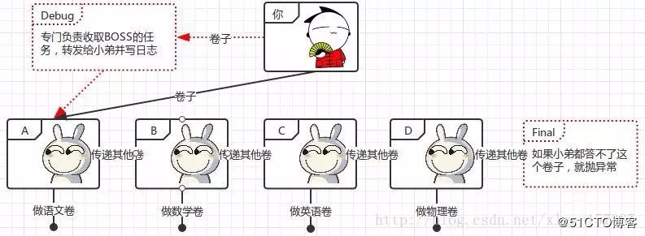
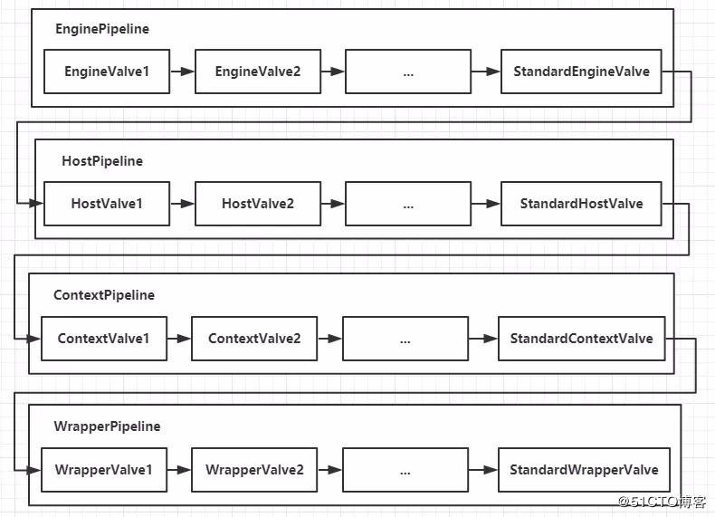

### http请求过程

   

### 顶层架构

    （1）Tomcat中只有一个Server，一个Server可以有多个Service，一个Service可以有多个Connector和一个Container；

    （2） Server掌管着整个Tomcat的生死大权；

    （4）Service 是对外提供服务的；

    （5）Connector用于接受请求并将请求封装成Request和Response来具体处理；

    （6）Container用于封装和管理Servlet，以及具体处理request请求；

### Connector和Container的微妙关系

    大致可以知道一个请求发送到Tomcat之后，
    首先经过Service然后会交给我们的Connector，
    Connector用于接收请求并将接收的请求封装为Request和Response来具体处理，
    Request和Response封装完之后再交由Container进行处理，
    Container处理完请求之后再返回给Connector，
    最后在由Connector通过Socket将处理的结果返回给客户端，
    这样整个请求的就处理完了

    Connector最底层使用的是Socket来进行连接的，Request和Response是按照HTTP协议来封装的，所以Connector同时需要实现TCP/IP协议和HTTP协议！

### Connector架构分析

   

    connector如何接收请求的？

    如何将请求封装成request和response

    封装完成后的request和response如何交给container

    container处理完之后如何交个connector并发返回客户端？

    Connector就是使用ProtocolHandler来处理请求的，不同的ProtocolHandler代表不同的连接类型，比如：Http11Protocol使用的是普通Socket来连接的，Http11NioProtocol使用的是NioSocket来连接的。

    ProtocolHandler由包含了三个部件：Endpoint、Processor、Adapter。

    （1）Endpoint用来处理底层Socket的网络连接，Processor用于将Endpoint接收到的Socket封装成Request，Adapter用于将Request交给Container进行具体的处理。
    （2）Endpoint由于是处理底层的Socket网络连接，因此Endpoint是用来实现TCP/IP协议的，而Processor用来实现HTTP协议的，Adapter将请求适配到Servlet容器进行具体的处理。
    （3）Endpoint的抽象实现AbstractEndpoint里面定义的Acceptor和AsyncTimeout两个内部类和一个Handler接口。Acceptor用于监听请求，AsyncTimeout用于检查异步Request的超时，Handler用于处理接收到的Socket，在内部调用Processor进行处理。

### Container架构分析
    Container用于封装和管理Servlet，以及具体处理Request请求，在Connector内部包含了4个子容器，结构图如下

   

    Engine: 引擎、管理多个站点，一个service只有一个engine
    Host：一个站点，可以叫虚拟主机，通过配置host可以添加站点
    Context：代表一个应用程序，对应值平时开发的一套程序或者一个WEB-INF目录及下面的web.xml文件
    Wrapper：每个wrapper封装着一个servlet

    Context和Host的区别是Context表示一个应用，我们的Tomcat中默认的配置下webapps下的每一个文件夹目录都是一个Context，其中ROOT目录中存放着主应用，其他目录存放着子应用，而整个webapps就是一个Host站点。
    ROOT可以设定

### Container如何处理请求的
    Container处理请求是使用Pipeline-Valve管道来处理的！（Valve是阀门之意）
    Pipeline-Valve是责任链模式，责任链模式是指在一个请求处理的过程中有很多处理者依次对请求进行处理，每个处理者负责做自己相应的处理，
    处理完之后将处理后的请求返回，再让下一个处理着继续处理

    Pipeline-Valve使用的责任链模式和普通的责任链模式有些不同！区别主要有以下两点：

   

    1、每个pipeline都有特定的Valve（阀），而且是管道的最后一个执行，这个valve叫BaseValve，不可删除
    2、在上层容器的管道的BaseValve中会调用下层容器的管道

    Container包含四个子容器，而这四个子容器对应的BaseValve分别在：
    StandardEngineValve、StandardHostValve、StandardContextValve、StandardWrapperValve。

   

    （1）Connector在接收到请求后会首先调用最顶层容器的Pipeline来处理，这里的最顶层容器的Pipeline就是EnginePipeline（Engine的管道）；

    （2）在Engine的管道中依次会执行EngineValve1、EngineValve2等等，最后会执行StandardEngineValve，在StandardEngineValve中会调用Host管道，然后再依次执行Host的HostValve1、HostValve2等，最后在执行StandardHostValve，然后再依次调用Context的管道和Wrapper的管道，最后执行到StandardWrapperValve。

    （3）当执行到StandardWrapperValve的时候，会在StandardWrapperValve中创建FilterChain，并调用其doFilter方法来处理请求，这个FilterChain包含着我们配置的与请求相匹配的Filter和Servlet，其doFilter方法会依次调用所有的Filter的doFilter方法和Servlet的service方法，这样请求就得到了处理！

    （4）当所有的Pipeline-Valve都执行完之后，并且处理完了具体的请求，这个时候就可以将返回的结果交给Connector了，Connector在通过Socket的方式将结果返回给客户端。

### 多个host怎么配置

