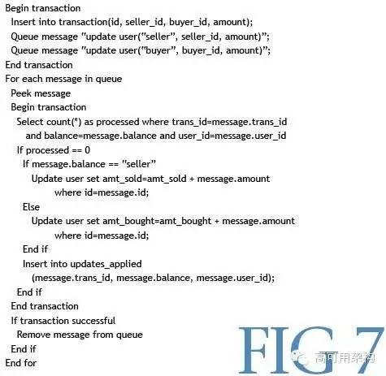
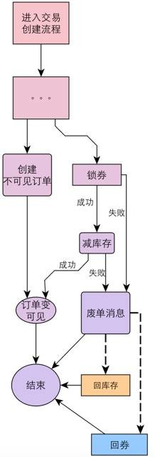
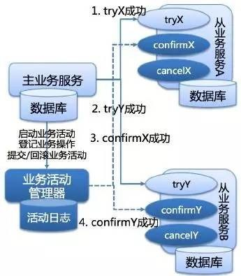

### Dubbo的底层实现原理和机制

### 为什么不用 zookeeper？

### 数据库一致性解决方案

#### 规避分布式事务-业务整合
    缺点：显而易见，把本来规划拆分好的业务，又耦合到了一起，业务职责不清晰，不利于维护。
#### eBay模式（最终一致性 BASE）
    basically available, soft state, eventually consistent
    将需要分布式处理的任务通过消息日志的方式来异步执行。消息日志可以存储到本地文本、数据库或消息队列，再通过业务规则自动或人工发起重试。
    人工重试更多的是应用于支付场景，通过对账系统对事后问题的处理

   

    在第一阶段，通过本地的数据库的事务保障，增加了 transaction 表及消息队列 。
    在第二阶段，分别读出消息队列（但不删除），通过判断更新记录表 updates_applied
        来检测相关记录是否被执行，未被执行的记录会修改 user 表，然后增加一条操作记录到
        updates_applied，事务执行成功之后再删除队列。

#### 去哪儿分布式事务方案
    将分布式事务转换为多个本地事务，然后依靠重试等方式达到最终一致性

#### 蘑菇街
    准实时的最终一致性
    过多依赖其他服务

   

#### 支付宝及蚂蚁金服DTS方案
    Distributed Transaction Service, DTS
    DTS 从架构上分为 xts-client 和 xts-server 两部分，前者是一个嵌入客户端应用的 JAR 包，主要负责事务数据的写入和处理；
    后者是一个独立的系统，主要负责异常事务的恢复

    最终一致：事务处理过程中，会有短暂不一致的情况，但通过恢复系统，可以让事务的数据达到最终一致的目标。
    协议简单：DTS 定义了类似 2PC 的标准两阶段接口，业务系统只需要实现对应的接口就可以使用 DTS 的事务功能。
    与 RPC 服务协议无关：在 SOA 架构下，一个或多个 DB 操作往往被包装成一个一个的 Service，Service 与 Service 之间通过 RPC 协议通信。DTS 框架构建在 SOA 架构上，与底层协议无关。
    与底层事务实现无关： DTS 是一个抽象的基于 Service 层的概念，与底层事务实现无关，也就是说在 DTS 的范围内，无论是关系型数据库 MySQL，Oracle，还是 KV 存储 MemCache，或者列存数据库 HBase，只要将对其的操作包装成 DTS 的参与者，就可以接入到 DTS 事务范围内。

   

    实现
    一个完整的业务活动由一个主业务服务与若干从业务服务组成。
    主业务服务负责发起并完成整个业务活动。
    从业务服务提供 TCC 型业务操作。
    业务活动管理器控制业务活动的一致性，它登记业务活动中的操作，并在活动提交时确认所有的两阶段事务的 confirm 操作，在业务活动取消时调用所有两阶段事务的 cancel 操作。”

    与 2PC 协议比较
    没有单独的 Prepare 阶段，降低协议成本
    系统故障容忍度高，恢复简单

#### 农信网方案

