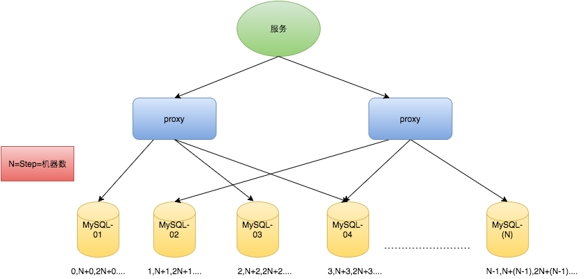

### Dubbo的底层实现原理和机制

### 为什么不用 zookeeper？

### 需要生成全局唯一的递增 ID, 并发量非常大, 怎么做
    snowflake
        snowflake 无法实现全局递增，只能实现全局唯一，单机递增
    似 TDDL 那样一次取一个 ID 段，放在本地慢慢分配的策略

## 限流
### 限流功能实现方法
    令牌桶
### 限流要做成分布式的, 怎么做?
    令牌桶维护到 Redis 里，每个实例起一个线程抢锁，抢到锁的负责定时放令牌
### 怎么抢锁?
    Redis setnx
### 锁怎么释放?
    抢到锁后设置过期时间，线程本身退出时主动释放锁，
    假如线程卡住了，锁过期那么其它线程可以继续抢占
### 加了超时之后有没有可能在没有释放的情况下, 被人抢走锁
    有可能，单次处理时间过长，锁泄露
### 怎么解决?
    换 zk，用心跳解决
### 不用 zk 的心跳, 可以怎么解决这个问题呢?
    每次更新过期时间时，Redis 用 MULTI 做 check-and-set 检查更新时间是否被其他线程修改了，假如被修改了，说明锁已经被抢走，放弃这把锁
### 假如这个限流希望做成可配置的, 需要有一个后台管理系统随意对某个 api 配置全局流量, 怎么做？
    在 Redis 里存储每个 API 的令牌桶 key，假如存在这个 key，则需要按上述逻辑进行限流

## 分布式数据一致性
### 数据库一致性解决方案

#### 规避分布式事务-业务整合
    缺点：显而易见，把本来规划拆分好的业务，又耦合到了一起，业务职责不清晰，不利于维护。
#### eBay模式（最终一致性 BASE）
    basically available, soft state, eventually consistent
    将需要分布式处理的任务通过消息日志的方式来异步执行。消息日志可以存储到本地文本、数据库或消息队列，再通过业务规则自动或人工发起重试。
    人工重试更多的是应用于支付场景，通过对账系统对事后问题的处理

   

    在第一阶段，通过本地的数据库的事务保障，增加了 transaction 表及消息队列 。
    在第二阶段，分别读出消息队列（但不删除），通过判断更新记录表 updates_applied
        来检测相关记录是否被执行，未被执行的记录会修改 user 表，然后增加一条操作记录到
        updates_applied，事务执行成功之后再删除队列。

#### 去哪儿分布式事务方案
    将分布式事务转换为多个本地事务，然后依靠重试等方式达到最终一致性

#### 蘑菇街
    准实时的最终一致性
    过多依赖其他服务

   

#### 支付宝及蚂蚁金服DTS方案
    Distributed Transaction Service, DTS
    DTS 从架构上分为 xts-client 和 xts-server 两部分，前者是一个嵌入客户端应用的 JAR 包，主要负责事务数据的写入和处理；
    后者是一个独立的系统，主要负责异常事务的恢复

    最终一致：事务处理过程中，会有短暂不一致的情况，但通过恢复系统，可以让事务的数据达到最终一致的目标。
    协议简单：DTS 定义了类似 2PC 的标准两阶段接口，业务系统只需要实现对应的接口就可以使用 DTS 的事务功能。
    与 RPC 服务协议无关：在 SOA 架构下，一个或多个 DB 操作往往被包装成一个一个的 Service，Service 与 Service 之间通过 RPC 协议通信。DTS 框架构建在 SOA 架构上，与底层协议无关。
    与底层事务实现无关： DTS 是一个抽象的基于 Service 层的概念，与底层事务实现无关，也就是说在 DTS 的范围内，无论是关系型数据库 MySQL，Oracle，还是 KV 存储 MemCache，或者列存数据库 HBase，只要将对其的操作包装成 DTS 的参与者，就可以接入到 DTS 事务范围内。

   

    实现
    一个完整的业务活动由一个主业务服务与若干从业务服务组成。
    主业务服务负责发起并完成整个业务活动。
    从业务服务提供 TCC 型业务操作。
    业务活动管理器控制业务活动的一致性，它登记业务活动中的操作，并在活动提交时确认所有的两阶段事务的 confirm 操作，在业务活动取消时调用所有两阶段事务的 cancel 操作。”

    与 2PC 协议比较
    没有单独的 Prepare 阶段，降低协议成本
    系统故障容忍度高，恢复简单

#### 农信网方案

### ID生成系统

   [美团ID生成ID](https://tech.meituan.com/2017/04/21/mt-leaf.html)

    全局唯一性：不能出现重复的ID号，既然是唯一标识，这是最基本的要求。
    趋势递增：在MySQL InnoDB引擎中使用的是聚集索引，由于多数RDBMS使用B-tree的数据结构来存储索引数据，在主键的选择上面我们应该尽量使用有序的主键保证写入性能。
    单调递增：保证下一个ID一定大于上一个ID，例如事务版本号、IM增量消息、排序等特殊需求。
    信息安全：如果ID是连续的，恶意用户的扒取工作就非常容易做了，直接按照顺序下载指定URL即可；
        如果是订单号就更危险了，竞对可以直接知道我们一天的单量。所以在一些应用场景下，会需要ID无规则、不规则。
    要求：
    平均延迟和TP999延迟都要尽可能低；
    可用性5个9；
    高QPS

    UUID
        优点：
        性能非常高：本地生成，没有网络消耗。
        缺点：
        不易于存储：UUID太长，16字节128位，通常以36长度的字符串表示，很多场景不适用。
        信息不安全：基于MAC地址生成UUID的算法可能会造成MAC地址泄露，这个漏洞曾被用于寻找梅丽莎病毒的制作者位置。
        ① MySQL官方有明确的建议主键要尽量越短越好[4]，36个字符长度的UUID不符合要求。
        ② 对MySQL索引不利：如果作为数据库主键，在InnoDB引擎下，UUID的无序性可能会引起数据位置频繁变动，严重影响性能。

    类snowflake方案
   

        41-bit的时间可以表示（1L<<41）/(1000L*3600*24*365)=69年的时间
        10-bit机器可以分别表示1024台机器
            如果我们对IDC划分有需求，还可以将10-bit分5-bit给IDC，分5-bit给工作机器。
            这样就可以表示32个IDC，每个IDC下可以有32台机器
        12个自增序列号可以表示2^12个ID
        理论上snowflake方案的QPS约为409.6w/s

        优点：
        毫秒数在高位，自增序列在低位，整个ID都是趋势递增的。
        不依赖数据库等第三方系统，以服务的方式部署，稳定性更高，生成ID的性能也是非常高的。
        可以根据自身业务特性分配bit位，非常灵活。

        缺点：
        强依赖机器时钟，如果机器上时钟回拨，会导致发号重复或者服务会处于不可用状态。

    Mongdb objectID

    数据库生成
        auto_increment_increment
        auto_increment_offset
        优点：
        非常简单，利用现有数据库系统的功能实现，成本小，有DBA专业维护。
        ID号单调自增，可以实现一些对ID有特殊要求的业务。
        缺点：
        强依赖DB，当DB异常时整个系统不可用，属于致命问题。
        配置主从复制可以尽可能的增加可用性，但是数据一致性在特殊情况下难以保证。主从切换时的不一致可能会导致重复发号。
        ID发号性能瓶颈限制在单台MySQL的读写性能。
        如果出现数据迁移可能导致灾难

   

        系统水平扩展比较困难
        ID没有了单调递增的特性，只能趋势递增，这个缺点对于一般业务需求不是很重要，可以容忍
        数据库压力还是很大，每次获取ID都得读写一次数据库，只能靠堆机器来提高性能

### 考虑一个业务场景: 头条的文章的评论量非常大, 比如说一篇热门文章就有几百万的评论, 设计一个后端服务, 实现评论的时序展示与分页
    id递增
    不需要支持页码翻页就传 评论id + offset 翻页

    2、假如用 id 翻页的方式, 数据库表如何设计? 索引如何设计?
        (文章id, 评论id) 建联合索引，评论 id 需递增
    3、假如量很大, 你觉得需要分库分表吗? 怎么分?
        需要分，分表有个权衡，按文章 id 分表，读逻辑简单，但写有热点问题；
        按评论 id 分表，读逻辑复杂，但写压力就平均了
        写是要首先保证的，而读总是有缓存等方案来折中，因此按评论 id 分表好
    4、分库分表后怎么查询分页?
        每张表查 N 条数据由 client 或 proxy merge
    5、分库分表后怎么保证主键仍然是递增的?（全局递增ID，ID预分配）
        有一张专门用于分配主键的表，每次用乐观锁的方式尝试去取一批主键过来分配，假如乐观锁失败就重试
    6、现在需要支持深分页, 页码直接跳转, 怎么实现?
        不能做精准深分页，否则压力太大，找产品进行妥协，在50或100页后数据分页是否可以不完全精确，假如可以，那么缓存深页码的起始评论 id
    7、瞬时写入量很大可能会打挂存储, 怎么保护?
        断路器
    8、断路器内部怎么实现的?
        可以用 ringbuffer
    9、断路器会造成写入失败, 假如我们不允许写入失败呢?
        先写进消息队列，削峰填谷异步落库