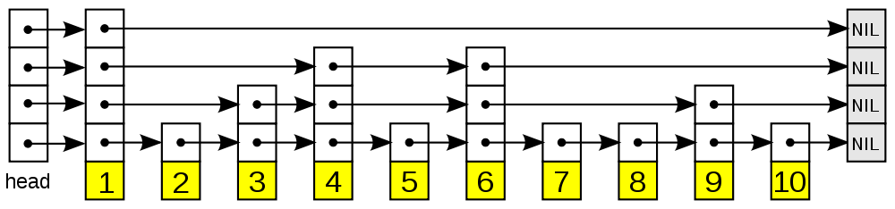

### redis
    优点：单线程：并发安全；高性能；原语与数据结构丰富；采用广泛，踩坑成本低

    1、数据结构的实现熟悉吗？
        zset 跳表
        跳跃表以有序的方式在层次化的链表中保存元素， 效率和平衡树媲美 —— 查找、删除、添加等操作都可以在对数期望时间下完成， 并且比起平衡树来说， 跳跃表的实现要简单直观得多
        一个有序非线性的数据结构,它底层核心的数据结构是跳表

   

        构成
        表头（head）：负责维护跳跃表的节点指针。
        跳跃表节点：保存着元素值，以及多个层。
        层：保存着指向其他元素的指针。高层的指针越过的元素数量大于等于低层的指针，为了提高查找的效率，程序总是从高层先开始访问，然后随着元素值范围的缩小，慢慢降低层次。
        表尾：全部由 NULL 组成，表示跳跃表的末尾。

        跳跃表在 Redis 的唯一作用， 就是实现有序集数据类型
        跳跃表将指向有序集的 score 值和 member 域的指针作为元素， 并以 score 值为索引， 对有序集元素进行排序。
        缺点即浪费了空间，自古空间和时间两难全
        redis 和 leveldb 中都有采用跳表
        排行榜
   2、用过 Redis 的哪些数据结构, 分别用在什么场景?

