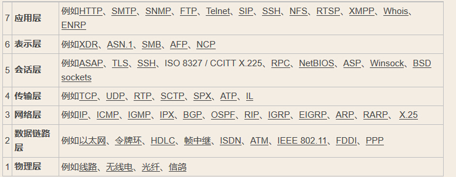

## Network Communication
### http是无状态通信，http的请求方式有哪些，可以自己定义新的请求方式么
    HTTP/1.1规定的 HTTP 请求方法有8种
    CONNECT:    HTTP/1.1协议预留的，能够将连接改为管道方式的代理服务器,通常用于SSL加密服务器的链接与非加密的HTTP代理服务器的通信
    OPTIONS     与HEAD类似，一般也是用于客户端查看服务器的性能, 这个方法会请求服务器返回该资源所支持的所有HTTP请求方法，该方法会用'*'来代替资源名称，向服务器发送OPTIONS请求，可以测试服务器功能是否正常。
    PUT:        PUT方法是幂等的方法。通过该方法客户端可以将指定资源的最新数据传送给服务器取代指定的资源的内容
    DELETE:     请求服务器删除所请求URI（统一资源标识符，Uniform Resource Identifier）所标识的资源。DELETE请求后指定资源会被删除，DELETE方法也是幂等的
    TRACE       请求服务器回显其收到的请求信息，该方法主要用于HTTP请求的测试或诊断
    GET:        一般来说GET方法应该只用于数据的读取，而不应当用于会产生副作用的非幂等的操作中,GET被认为是不安全的方法，因为GET方法会被网络蜘蛛等任意的访问
    HEAD:       常被用于客户端查看服务器的性能,服务器在响应HEAD请求时不会回传资源的内容部分，即：响应主体
    POST:       包含了 Content-Type 和消息主体编码方式两部分,POST方法是非幂等的方法，因为这个请求可能会创建新的资源或/和修改现有资源
    PATCH:      一般用于资源的部分更新，而PUT一般用于资源的整体更新,当资源不存在时，PATCH会创建一个新的资源，而PUT只会对已在资源进行更新

    特定的 HTTP 服务器支持扩展自定义的方法
   [知乎](https://www.zhihu.com/question/61409098)
   [参考](https://stackoverflow.com/questions/36642805/create-a-custom-http-method)

### socket通信，以及长连接，分包，连接异常断开的处理
#### socket通信
   

   
#### socket长连接
   [参考](http://ngudream.com/2017/04/09/java-interview-network-communication/)

    长连接：指在一个 TCP 连接上可以连续发送多个数据包，在 TCP 连接保持期间，如果没有数据包发送，需要双方发检测包以维持此连接；一般需要自己做在线维持。
    短连接：指通信双方有数据交互时，就建立一个 TCP 连接，数据发送完成后，则断开此 TCP 连接；一般银行都使用短连接。它的优点是：管理起来比较简单，存在的连接都是有用的连接，不需要额外的控制手段。
#### 分包，粘包
    之所以出现粘包和半包现象，是因为 TCP 当中，只有流的概念，没有包的概念
    粘包与分包指发送方发送的若干包数据到接收方接收时粘成一包，从接收缓冲区看，后一包数据的头紧接着前一包数据的尾
    什么时候需要考虑半包的情况？

#### 连接异常断开处理

