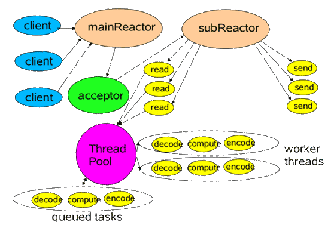
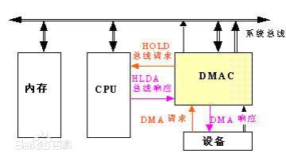

## Network Communication
### http是无状态通信，http的请求方式有哪些，可以自己定义新的请求方式么
    HTTP/1.1规定的 HTTP 请求方法有8种
    CONNECT:    HTTP/1.1协议预留的，能够将连接改为管道方式的代理服务器,通常用于SSL加密服务器的链接与非加密的HTTP代理服务器的通信
    OPTIONS     与HEAD类似，一般也是用于客户端查看服务器的性能, 这个方法会请求服务器返回该资源所支持的所有HTTP请求方法，该方法会用'*'来代替资源名称，向服务器发送OPTIONS请求，可以测试服务器功能是否正常。
    PUT:        PUT方法是幂等的方法。通过该方法客户端可以将指定资源的最新数据传送给服务器取代指定的资源的内容
    DELETE:     请求服务器删除所请求URI（统一资源标识符，Uniform Resource Identifier）所标识的资源。DELETE请求后指定资源会被删除，DELETE方法也是幂等的
    TRACE       请求服务器回显其收到的请求信息，该方法主要用于HTTP请求的测试或诊断
    GET:        一般来说GET方法应该只用于数据的读取，而不应当用于会产生副作用的非幂等的操作中,GET被认为是不安全的方法，因为GET方法会被网络蜘蛛等任意的访问
    HEAD:       常被用于客户端查看服务器的性能,服务器在响应HEAD请求时不会回传资源的内容部分，即：响应主体
    POST:       包含了 Content-Type 和消息主体编码方式两部分,POST方法是非幂等的方法，因为这个请求可能会创建新的资源或/和修改现有资源
    PATCH:      一般用于资源的部分更新，而PUT一般用于资源的整体更新,当资源不存在时，PATCH会创建一个新的资源，而PUT只会对已在资源进行更新

    特定的 HTTP 服务器支持扩展自定义的方法
   [知乎](https://www.zhihu.com/question/61409098)
   [参考](https://stackoverflow.com/questions/36642805/create-a-custom-http-method)

### socket通信，以及长连接，分包，连接异常断开的处理
#### socket通信
   

   

#### socket长连接
   [参考](http://ngudream.com/2017/04/09/java-interview-network-communication/)

    长连接：指在一个 TCP 连接上可以连续发送多个数据包，在 TCP 连接保持期间，如果没有数据包发送，需要双方发检测包以维持此连接；一般需要自己做在线维持。
    短连接：指通信双方有数据交互时，就建立一个 TCP 连接，数据发送完成后，则断开此 TCP 连接；一般银行都使用短连接。它的优点是：管理起来比较简单，存在的连接都是有用的连接，不需要额外的控制手段。
#### 分包，粘包
    之所以出现粘包和半包现象，是因为 TCP 当中，只有流的概念，没有包的概念
    粘包与分包指发送方发送的若干包数据到接收方接收时粘成一包，从接收缓冲区看，后一包数据的头紧接着前一包数据的尾

    半包：由于 TCP 为提高传输效率，将一个包分配的足够大，导致接受方并不能一次接受完。（在长连接和短连接中都会出现）
    分包：分包是指在出现粘包的时候我们的接收方要进行分包处理
    粘包：它既可能由发送方造成，也可能由接收方造成
         发送方引起的粘包是由 TCP 协议本身造成的，TCP 为提高传输效率，发送方往往要收集到足够多的数据后才发送一包数据。
         若连续几次发送的数据都很少，通常 TCP 会根据优化算法把这些数据合成一包后一次发送出去，这样接收方就收到了粘包数据。

         接收方引起的粘包是由于接收方用户进程不及时接收数据，从而导致粘包现象。这是因为接收方先把收到的数据放在系统接收缓冲区，用户进程从该缓冲区取数据，
         若下一包数据到达时前一包数据尚未被用户进程取走，则下一包数据放到系统接收缓冲区时就接到前一包数据之后，而用户进程根据预先设定的缓冲区大小从系统接收缓冲区取数据，这样就一次取到了多包数据
    什么时候考虑半包?
        socket默认缓冲区大小大概8K，可以自定义
        处理方式：
        1、通过包头 + 包长 + 包体的协议形式，当服务器端获取到指定的包长时才说明获取完整。
        2、指定包的结束标识，这样当我们获取到指定的标识时，说明包获取完整。
    什么时候考虑粘包?
        当是短连接的情况下，不用考虑粘包的情况
        如果发送数据无结构，如文件传输，这样发送方只管发送，接收方只管接收存储就 ok，也不用考虑粘包
        如果双方建立连接，需要在连接后一段时间内发送不同结构数据
    如何处理粘包
        接收方创建一预处理线程，对接收到的数据包进行预处理，将粘连的包分开
        注：粘包情况有两种，一种是粘在一起的包都是完整的数据包，另一种情况是粘在一起的包有不完整的包

#### 连接异常断开处理
    客户端程序异常
        服务端处理这个异常
    网络链路异常
        如：网线拔出、交换机掉电、客户端机器掉电
        当出现这些情况的时候服务端不会出现任何异常
        1、定时发送简单约定帧
            服务器更新客户端的超时计数，超过阀值就关闭连接
        2、ping+send/receive
            ping判断网络状态
            服务器禁止ping时存在缺陷
        3、keepalive - timer
            心跳机制
### socket通信模型的使用，BIO,AIO和NIO
    java的角度
#### BIO（同步阻塞IO）一个连接一个线程
    每一个 SOCKET 连接，都需要一个线程来监听，对于传输小数据的短连接问题还不大，如果是传输大数据的长连接，
    那就会有大量线程在系统中，非常浪费内存
#### NIO（同步非阻塞IO）一个请求一个线程，一个线程多个请求
    JDK1.4+
    1. 由一个专门的线程来处理所有的 IO 事件，并负责分发。
    2. 事件驱动机制：事件到的时候触发，而不是同步的去监视事件。
    3. 线程通讯：线程之间通过 wait,notify 等方式通讯。保证每次上下文切换都是有意义的。减少无谓的线程切换。
#### AIO（异步非阻塞）一个有效请求一个线程
    JDK1.7+

    AIO在性能上相对于NIO没有本质的提升。
    AIO只是帮助你从内核中将数据复制到用户空间中，并调用你传入的回调方法。
    NIO 是需要程序自己从内核中将数据复制到用户空间中，并需要程序自己调用相应的处理逻辑。
### socket框架netty的使用，以及NIO的实现原理，为什么是异步非阻塞

   

    Netty是一个高性能 事件驱动的异步的非堵塞的IO(NIO)框架，用于建立TCP等底层的连接

   

    DMA: 直接存储访问
    DMA 传输将数据从一个地址空间复制到另外一个地址空间。当CPU 初始化这个传输动作，传输动作本身是由 DMA 控制器来实行和完成。
    在实现DMA传输时，是由DMA控制器直接掌管总线，因此，存在着一个总线控制权转移问题。即DMA传输前，CPU要把总线控制权交给DMA控制器，而在结束DMA传输后，DMA控制器应立即把总线控制权再交回给CPU。

    零拷贝
    CPU只是发出写操作这样的指令，做一些初始化工作，DMA具体执行，从内存中读取数据，然后写到磁盘，当完成写后发出一个中断事件给CPU。这段时间CPU是空闲的，可以做别的事情。这个原理称为Zero.copy零拷贝。
    Netty底层基于上述Java NIO的零拷贝原理实现：

### 同步和异步，阻塞和非阻塞

#### 同步与异步
    关注的是消息通信机制
    同步：发出一个调用时，在没有得到结果之前，该调用就不返回
    异步：调用在发出之后，这个调用就直接返回了，所以没有返回结果；在调用发出后，被调用者通过状态、通知来通知调用者，或通过回调函数处理这个调用；

#### 阻塞与非阻塞
    关注的是程序在等待调用结果（消息，返回值）时的状态
    阻塞调用是指调用结果返回之前，当前线程会被挂起。调用线程只有在得到结果之后才会返回。
    非阻塞调用指在不能立刻得到结果之前，该调用不会阻塞当前线程。

### 说说浏览器访问 www.taobao.com，经历了怎样的过程

    根据域名查询 IP 地址的顺序如下
    浏览器 DNS >>> 操作系统 DNS 缓存 >>> 本地（ISP）域名服务器缓存 >>> 根域名服务器。

    （1）首先是查找浏览器缓存
    浏览器会保存一段时间你之前访问过的一些网址的 DNS 信息，不同浏览器保存的时常不等。
    如果没有找到对应的记录，这个时候浏览器会尝试调用系统缓存来继续查找这个网址的对应 DNS 信息。
    如果还是没找到对应的 IP，那么接着会发送一个请求到路由器上，然后路由器在自己的路由器缓存上查找记录，路由器一般也存有 DNS 信息。
    如果还是没有，这个请求就会被发送到 ISP（注：Internet Service Provider，互联网服务提供商，就是那些拉网线到你家里的运营商，中国电信中国移动什么的），ISP 也会有相应的 ISP DNS 服务器
    如果还是没有的话， 你的 ISP 的 DNS 服务器会将请求发向根域名服务器进行搜索。
    根域名服务器就是面向全球的顶级 DNS 服务器，共有 13 台逻辑上的服务器，从 A 到 M 命名，真正的实体服务器则有几百台，分布于全球各大洲。所以这些服务器有真正完整的 DNS 数据库。
    如果到了这里还是找不到域名的对应信息，那只能说明一个问题：这个域名本来就不存在，它没有在网上正式注册过。或者卖域名的把它回收掉了（通常是因为欠费）。
    "mp3.baidu.com"，域名先是解析出这是个. com 的域名，然后跑到管理. com 域名的服务器上进行进一步查询，然后是. baidu，最后是 mp3，所以域名结构为：三级域名. 二级域名. 一级域名。
    （2）浏览器主机根据 IP 地址与服务器建立 TCP 连接。
    （3）浏览器将访问请求封装为一个 HTTP 请求报文，通过 TCP 协议发送给服务器。
    （4）服务器收到请求并响应，生成一个 HTTP 响应报文，通过 TCP 协议发送给浏览器主机。
    （5）浏览器得到响应报文之后，对响应报文进行解析。
    （6）浏览器异步请求其他资源。

### https、http、ssl

#### http
    应用层的面向对象的协议
    以明文方式发送内容，不提供任何方式的数据加密
#### https
    1）客户端发起 HTTPS 请求
    用户在浏览器里输入一个 https 网址，然后连接到 server 的 443 端口
    2）服务端的配置
    采用 HTTPS 协议的服务器必须要有一套数字证书，可以自己制作，也可以向组织申请，区别就是自己颁发的证书需要客户端验证通过，才可以继续访问，而使用受信任的公司申请的证书则不会弹出提示页面
    这套证书其实就是一对公钥和私钥
    3）传送证书
    这个证书其实就是公钥，只是包含了很多信息，如证书的颁发机构，过期时间等等。
    4）客户端解析证书
    这部分工作是有客户端的 TLS 来完成的，首先会验证公钥是否有效
    如果证书没有问题，那么就生成一个随机值，然后用证书对该随机值进行加密
    5）传送加密信息
    这部分传送的是用证书加密后的随机值，目的就是让服务端得到这个随机值，以后客户端和服务端的通信就可以通过这个随机值来进行加密解密了。
    6）服务段解密信息
    服务端用私钥解密后，得到了客户端传过来的随机值 (私钥)，然后把内容通过该值进行对称加密，
    所谓对称加密就是，将信息和私钥通过某种算法混合在一起，这样除非知道私钥，不然无法获取内容，而正好客户端和服务端都知道这个私钥，所以只要加密算法够彪悍，私钥够复杂，数据就够安全。
    7）传输加密后的信息
    这部分信息是服务段用私钥加密后的信息，可以在客户端被还原。
    8）客户端解密信息
    客户端用之前生成的私钥解密服务段传过来的信息，于是获取了解密后的内容，整个过程第三方即使监听到了数据，也束手无策。

   

