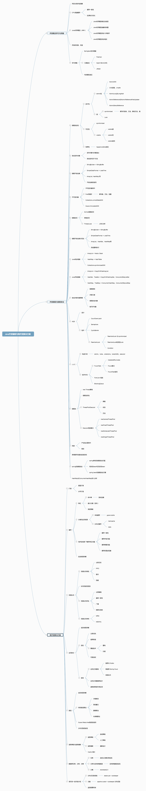

# 高并发解决方案

[参考1](https://www.jianshu.com/p/e6de7020d627)

## 系统或服务器级别解决方案
    ①增大服务器的CPU

    ②增加内存条

    ③增加硬盘个数，对硬盘做Radis

    ④换掉免费的tomcat，使用商用weblogic(美国Oracle公司出品的)

    ⑤增加到二块网卡

    ⑥聘请系统架构师优化Linux内核

    ⑦甚至花高价直接购买高性能的服务器
## 应用级别的解决方案

### 1、html静态化

### 2、图片服务器分离

### 3、数据库集群和库表散列
    分表分库

### 4、缓存

### 5、镜像

### 6、负载均衡

    3大功能
        ①转发：在用户请求，转发请求的功能

        ②故障移除：如果这一台机器挂了，负载均衡服务器不会再把请求转发到这台服务器

        ③恢复添加：如果这一台机器恢复正常了，负载均衡服务器会把它重新添加回来

    软负载
        nginx
            Ngnix有”单点故障“的问题，如果挂了，会带来很多的麻烦。到了后期Web服务器继续增加，它本身可能会成为系统的瓶颈
            nginx最高支持50000个并发连接数，工作在网路七层上
        Apache
            web服务器第一，但不是最好的负载均衡服务器，工作在网路七层上
        lvs
            最好的软件策略，有备机有主机，无单点问题，国产(阿里章文嵩博士)开源项目，工作在网络四层上
        微服务负载均衡
        springcloud gateway
        zuul

        效率最高的负载均衡技术中，最高的就是IP负载均衡技术。IP虚拟服务器软件(IPVS)是在Linux内核中实现的,LVS就是使用的IP负载均衡技术

        常用的高可用方案(HA)都包括两种机器，LVS： 主机 备机
    硬负载
        NetScaler、F5、Radware和Array等商用的负载均衡器，它们性能好，但是价格比较昂贵的

    高并发发生在两处
        ①负载均衡服务器
        ②数据库
### 数据库并发

    ①要求：随着业务量的不断增大，数据库承载能力也要增大

    ②要求：数据安全，不能丢失

    ③要求：支持备份+容灾

   [学习思维导图](https://my.oschina.net/u/3418748/blog/1788681)

   [高并发探索](https://blog.csdn.net/jesonjoke/column/info/21011)

   [漫谈Java高并发](https://www.toutiao.com/a6574556081635197453)

   [数据库查考](http://naotu.baidu.com/file/b332b8e120d25509798d75b07734031b)

    密码：a8ni

### Hadoop集群和RDMS之间数据处理流程：**

    ①通过sqoop把关系型数据库的数据导入到HDFS中

    ②把HDFS中的数据经过MapReduce进行计算及处理

    ③将处理后的解决数据写回到HDFS文件系统

    ④把结果数据倒回关系型数据库

    ⑤将关系型数据库的数据形成报表展示

### java高并发编程方面

#### 编程规约

#### NIO

#### 多线程

#### JVM优化

#### MySQL数据库优化

#### 限制措施

## 解决用户IP多了的办法是?
    开始使用DNS：
        缺点：虽然循环复用DNS是一个普遍使用的在Web服务器上负载平衡的解决方案，但是，该方式有它自身的缺陷。
        循环复用DNS将传入的IP请求映射到定义的一系列循环形式的服务器。
        一旦发生服务器故障，循环复用DNS继续把请求发送到这个故障服务器，一直到把该服务器从DNS中移走为止。
        这样许多用户必须等到DNS连接超时以后才能成功的访问目的网站。
    终极解决方案：
        采用负载均衡技术

## 在集群下,Session是如何共享的三种方案(优劣对比)
    客户端Cookie保存
        优点是session信息不用存放在服务器端，大大减轻了服务器的压力
        一个session中的两次或多次请求可以在一个集群中的多个服务器上完成，可以避免单点故障
        目前，淘宝是采用的这种解决方案
        缺点有几个，
            一是传递cookie时，http信息头的长度限制使我们只能够在cookie中存入一部分用户信息；
            二是需要额外地做session信息加密的工作；
            第三，如果采用这种方式，每次访问网站二级域名时都会在http信息头中带有这些以cookie形式存储的session信息，会占用一定的带宽；
            最后，由于这种方式是在客户端进行信息存储，用户完全可以禁用cookie或删除cookie，不是很可靠。

    服务器间Session同步、
        缺点：比如速度慢、不稳定等，另外，如果session信息传递是主->从单向的，会有一些风险，
        同时对海量访问或密集型访问，可能会出现不同步或重复登录的情况。

    使用集群管理Session、
        目前大多都是使用Memcache来对Session进行存储。
        以Memcache来实现Session共享的方式目前比较流行的有两种实现方案
        使用Filter方式
            此方式使用过滤器的方式重新对httpRequest 对象进行了包装，并加入memcached客户端,
            此方式的优点是：使用简单，把过滤器配置进去即可，另外比较灵活，因为它是在客户端实现的，配置比较灵活,而且服务器无关，你可以在任何支持servlet的容器上部署。
        memcached-session-manager（MSM）
            memcached-session-manager，俗称MSM，是一个用于解决分布式tomcat环境下session共享的问题的开源解决方案。它的实现原理为以tomcat插件的方式部署在服务器，修改了servlet容器代码中的session相关代码，使其连接memcached，在memcached中创建和更新session。MSM拥有如下特性：
            支持Tomcat6、Tomcat7
            支持黏性、非黏性Session
            无单一故障点
            可处理tomcat故障转移
            可处理memcached故障转移
            插件式session序列化
            允许异步保存session，以提升响应速度
            只有当session有修改时，才会将session写回memcached
            JMX管理&监控
            优点：开发者不用考虑session共享的问题了,可以专注于程序开发，像正常使用session那样使用就完事了。不用显示编写代码，只需要对服务器进行配置即可使用。
            缺点：如果你想改变session策略的话，必须重新部署每个服务器的servlet容器。

            https://code.google.com/archive/p/memcached-session-manager/
    把Session持久化到数据库
        这种共享session的方式即将session信息存入数据库中，其它应用可以从数据库中查出session信息。目前采用这种方案时所使用的数据库一般为mysql。
        利用数据库共享session的方案有一定的实用性，但也有如下缺点：首先session的并发读写在数据库中完成，对mysql的性能要求比较高；其次，我们需要额外地实现session淘汰逻辑代码，即定时从数据库表中更新和删除session信息，增加了工作量。
        　　随着NoSQL数据库的发展及针对海量数据场景的大量应用，把Session持久化到基于Redis,MongoDB的数据库中很好地解决了类mysql关系数据库性能的问题，同时，一些开源框架中已默认支持了这种Session共享方式，更加推广了它的应用范围和场合。

## 访问人数过多时,而引起的高并发解决方案(原理,搭建,演示)

# 实时性解决方案
