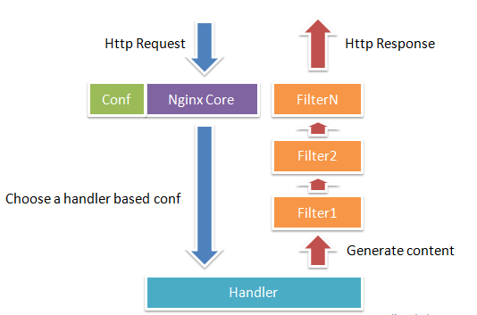
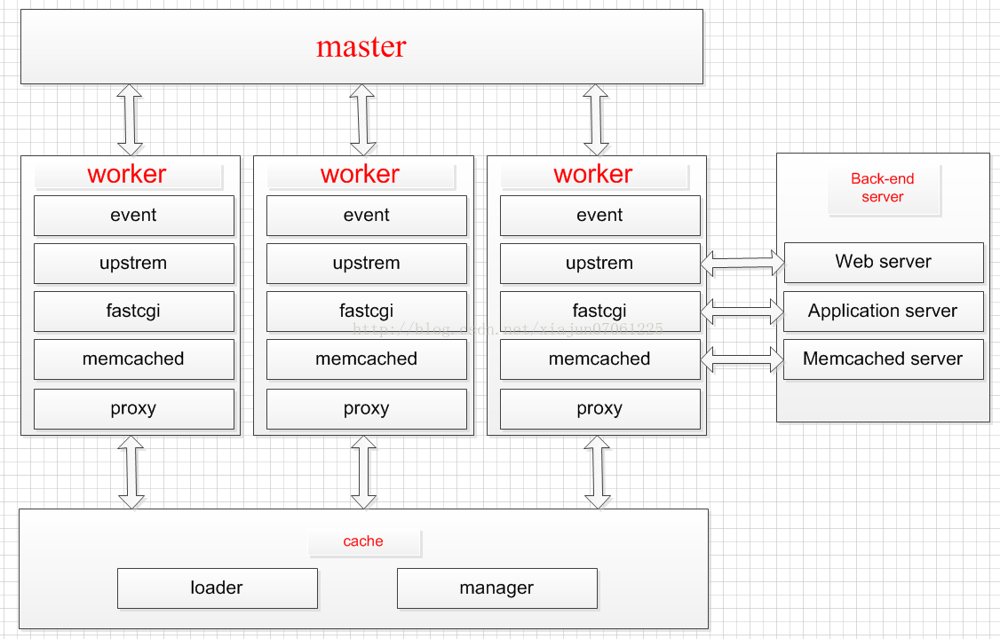

https://www.infoq.cn/article/comparing-api-gateway-performances
# nginx
 

 Nginx 的模块直接被编译进 Nginx，因此属于静态编译方式。启动 Nginx 后，Nginx 的模块被自动加载，不像 Apache，首先将模块编译为一个 so 文件，然后在配置文件中指定是否进行加载。

 Nginx 的每个模块都有可能去处理某个请求，但是同一个处理请求只能由一个模块来完成

 Nginx 在启动后，会有一个 Master 进程和多个 Worker 进程，Master 进程和 Worker 进程之间是通过进程间通信进行交互的，如图所示

 
# netflix zuul

    Zuul 是 Netflix 开源的微服务网关组件，它可以和 Eureka、Ribbon、Hystrix 等组件配合使用。Zuul 的核心是一系列的过滤器，这些过滤器可以完成以下功能：
    身份认证与安全：识别每个资源的验证要求，并拒绝那些与要求不符的请求。
    审查与监控：与边缘位置追踪有意义的数据和统计结果，从而带来精确的生产视图。
    动态路由：动态地将请求路由到不同的后端集群。
    压力测试：逐渐增加指向集群的流量，以了解性能。
    负载分配：为每一种负载类型分配对应容量，并弃用超出限定值的请求。
    静态响应处理：在边缘位置直接建立部分响应，从而避免其转发到内部集群。
    多区域弹性：跨越 AWS Region 进行请求路由，旨在实现 ELB（Elastic Load Balancing，弹性负载均衡）使用的多样化，以及让系统的边缘更贴近系统的使用者。
# spring cloud gateway
# linkerd